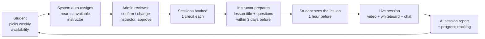

# OneClup — Online English Club Platform

**OneClup** (*O*nline *E*nglish *Cl*ub *P*latform) is a platform for **practising spoken
English with real instructors**, with AI in a strictly supporting role. Learners who already
read and write some English come here to *speak* — regularly, with a human, at times that fit
their week — and to watch their confidence grow session after session.

The name is the promise: an online *club* you belong to, not a course you finish.

---

## Vision & goals

- **Speaking first.** The scarce thing for most learners isn't grammar rules — it's *time
  talking to a person*. OneClup exists to make that time easy to get and easy to keep.
- **Human at the centre, AI on the edges.** Every session is a real conversation with a
  vetted instructor. AI never teaches the lesson or replaces the instructor; it only helps
  around the edges (placement, question ideas, after-session analysis, optional solo drills).
- **Availability-first, not catalogue-first.** The learner says *when* they're free; the
  platform does the matchmaking. No hunting through a catalogue of topics or teachers.
- **Confidence you can see.** Every session ends with an AI report, and progress is tracked
  skill-by-skill over time so the learner can watch themselves improve.
- **Accessible where card payments aren't.** Payment is by **local bank transfer**, reviewed
  by an admin — no card required.
- **Bilingual by default.** The entire interface works in **English and Arabic** (RTL), so
  the platform itself is never a barrier.

---

## How it works — the core flow

The heart of OneClup is a three-role loop: the **student** offers their availability, the
**admin** assigns and approves, the **instructor** prepares and teaches, and everyone sees
the result.



1. **Student → availability.** On *My Availability* the student taps the weekday+time cells
   they can attend. No topic is chosen — the lesson is the instructor's job.
2. **System → auto-assignment.** For each chosen time the platform picks the *nearest
   available* instructor (an instructor whose weekly availability covers that time,
   load-balanced across students).
3. **Admin → review gate.** On *Scheduling requests* the admin sees each student's times with
   the auto-assigned instructor **plus every other instructor free at that time**. The admin
   confirms, reassigns, or rejects a pick with a note — then approves.
4. **Booking generation.** On approval, the platform materialises concrete sessions for the
   coming weeks, consuming one **session credit** each, and notifies the instructor. A rolling
   background job keeps future weeks booked as time passes and as credits are topped up.
5. **Instructor → lesson prep.** On *Lesson prep* the instructor writes each session's
   **title + discussion questions** (free-form, with an optional **"Suggest with AI"** button).
   Editing is allowed only within **3 days before** the session, so lessons stay fresh.
6. **Student → 1-hour reveal.** The lesson title and questions unlock for the student
   **1 hour before** the session, so they can prepare — never earlier.
7. **Live session.** Real-time video room with whiteboard, chat, screen-share, files,
   raise-hand, and recording controls.
8. **AI report + progress.** After the session an AI report scores grammar, vocabulary,
   fluency, pronunciation and confidence, with strengths, mistakes and homework. Skill scores
   are tracked over time on the student's progress dashboard.

---

## The three journeys in detail

### 👩‍🎓 Student
Register → pick a learning goal → take a short **AI placement test** (written + spoken) → pay
by **bank transfer** and wait for admin approval → set **weekly availability** → get sessions
booked after review → see each **lesson 1 hour before** → attend the **live session** → read
the **AI report** and track **progress**. Optionally, practise solo with the **AI Tutor**
(a separate, optional subscription — 5-minute spoken drills with adjustable voice).

### 🛡️ Admin
Approve/reject **payment proofs** (activating subscriptions and credits) → work the
**scheduling requests** queue (confirm/replace the auto-assigned instructor, approve or reject
each student's times) → manage **members, instructors, plans, bookings** → view **business
metrics** and the **audit log**. Every consequential action is audit-logged.

### 👨‍🏫 Instructor
Set **weekly availability** (the windows they can teach) → get **auto-assigned** students whose
times fit → on **Lesson prep**, author each upcoming session's **title + questions** (AI can
suggest questions) within the 3-day window → teach the **live session** → review/accept the
**AI report**. Instructors also have a public **profile / CV** page.

---

## Key concepts

- **Availability-first scheduling.** Students choose times; instructors are matched by
  availability, not chosen from a list.
- **Admin review gate.** No session is created until an admin approves the student's times
  (and the assigned instructor). New or edited picks return to *pending*.
- **Session credits & subscriptions.** Duration-based plans (session / week / month / …),
  activated by an admin after a **local bank transfer**. Each booked session spends one credit;
  a top-up immediately materialises any approved schedule that was starved of credits.
- **Per-session lessons.** The lesson (title + questions) lives on the individual session,
  authored by the instructor within **3 days before** and revealed to the student **1 hour
  before**. This is separate from any legacy topic library.
- **Cancellation is respected.** If a student cancels a recurring occurrence, the rolling
  generator never silently recreates (or re-charges) it.
- **AI Tutor (optional).** A separate subscription for short, solo, 5-minute spoken practice
  in the dashboard, with selectable voice and pitch.
- **Bilingual (EN/AR).** Full English/Arabic UI with right-to-left support; dates localise to
  the active language.

## What AI does — and doesn't

AI is a **supporting tool**, never the teacher:

1. Scores the **placement test**.
2. **Suggests discussion questions** from a lesson title (instructor edits/keeps them).
3. **Analyses the session** afterward into a structured report.
4. Powers the optional **AI Tutor** solo-practice drills.

It falls back to safe, deterministic behaviour when no AI provider key is configured, so the
platform always works. The **live conversation is always fully human.**

---

## Architecture

A Django REST backend and a React single-page app, layered with a domain-driven structure.

```
backend/                     Django 5 + DRF
├── apps/                    models + services (scheduling, accounts, billing,
│                            sessions, ai_reports, ai_tutor, placement, notifications, …)
├── application/             use cases + queries (permission boundary, DTO mapping)
├── domain/                  framework-free rules
├── infrastructure/          gateways (video, AI, email) + repositories
├── api/                     DRF views · urls · serializers
└── config/                  settings, ASGI/WSGI

src/                         React 18 + Vite + TypeScript
├── routes/                  role-gated routes
├── pages/                   public · onboarding · billing · student · instructor · admin
├── components/              layout · session (video/whiteboard/recording) · ui · marketing
├── hooks/ · api/            React Query hooks over a typed API client
├── i18n/                    English source + Arabic dictionary (tx / t)
└── query/                   query keys + client
```

**Stack:** Django 5 · DRF · SimpleJWT · PostgreSQL · Redis · React 18 · Vite · TypeScript ·
TailwindCSS · @tanstack/react-query · react-router 7 · recharts · lucide-react. Live video via
Agora (stub fallback), AI via OpenAI (deterministic stub fallback).

---

## Running locally

**Backend**
```bash
cd backend
pip install -r requirements.txt
python manage.py migrate
python manage.py seed_reference            # baseline goals/plans
python manage.py runserver
```

**Frontend**
```bash
npm install
npm run dev        # Vite dev server
npm run build      # type-check + production build
```

**Tests**
```bash
cd backend && pytest         # backend
npx vitest run               # frontend
```

## Deployment

Containerised with Docker Compose (`docker-compose.yml`): the web image (Django + built SPA
served by Nginx), Postgres, Redis, and a **scheduler** service that runs the time-based jobs
(session reminders every 5 min; rolling booking generation hourly). See
[`deploy/DEPLOYMENT.md`](deploy/DEPLOYMENT.md) for the full guide, including the optional
integrations that fall back to stubs until configured:

| Feature | Env |
|---|---|
| Live video (Agora) | `AGORA_APP_ID`, `AGORA_APP_CERTIFICATE`, build arg `VITE_AGORA_APP_ID` |
| AI (OpenAI) | `OPENAI_API_KEY` |
| Email | `EMAIL_HOST*`, `EMAIL_BACKEND=…smtp…`, `NOTIFICATION_EMAILS_ENABLED=true` |

Migrations and static collection run automatically on container start.

---

## نظرة عامة (بالعربية)

**OneClup — منصة نادي اللغة الإنجليزية عبر الإنترنت.** الهدف: أن يتدرّب المتعلّم على
**التحدّث بالإنجليزية مع مدرّس حقيقي** بانتظام وفي الأوقات التي تناسبه، مع الذكاء الاصطناعي في
دور **مساعد فقط** لا يحلّ محلّ المدرّس.

**التدفّق الأساسي (الطالب ← الإدارة ← الأستاذ):**

1. **الطالب** يحدّد **أوقاته المتاحة** أسبوعيًا (يوم + ساعة) فقط، بلا اختيار موضوع.
2. **النظام** يُسنِد تلقائيًا **أقرب أستاذ متاح** في تلك الأوقات.
3. **الإدارة** تراجع الطلبات: تؤكّد المدرّس أو تغيّره أو ترفض الوقت، ثم تعتمد.
4. عند الاعتماد **تُحجز الجلسات** (جلسة مقابل رصيد واحد) ويُشعَر الأستاذ.
5. **الأستاذ** يكتب لكل جلسة **عنوانًا وأسئلة** (بمساعدة زر الذكاء الاصطناعي) خلال **٣ أيام
   قبلها** فقط.
6. **الطالب** يرى الدرس **قبل الجلسة بساعة** ليجهّز نفسه.
7. جلسة مباشرة (فيديو + سبورة + محادثة)، ثم **تقرير ذكاء اصطناعي** وتتبّع للتقدّم.

الدفع عبر **تحويل بنكي محلي** يعتمده الأدمن. الواجهة **ثنائية اللغة (عربي/إنجليزي)** بالكامل مع
دعم الاتجاه من اليمين لليسار. ومعلّم ذكي اختياري (AI Tutor) للتدريب الفردي القصير.
